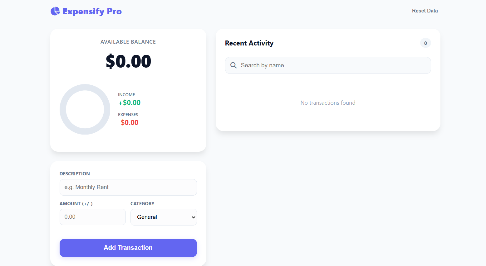
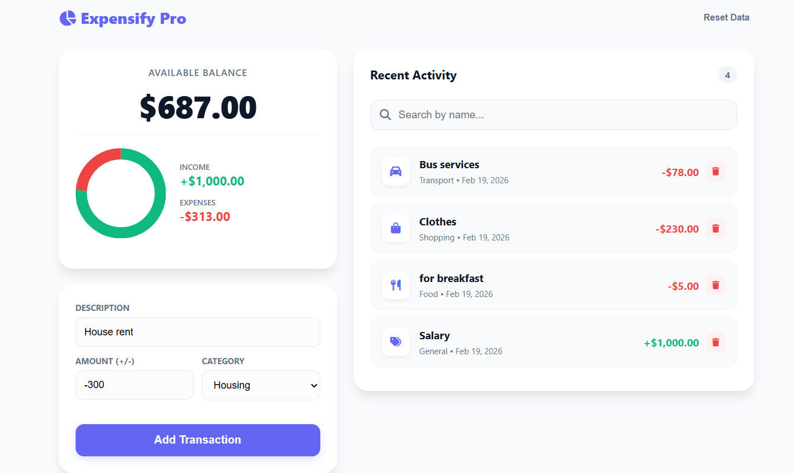

# 💰 Expense Tracker – Expensify Pro Plus

A professional-grade **Expense Tracker** application designed for clarity, ease of use and a clean visual interface. Track your finances, view analytics and manage your income and expenses—all in one place.  

---

## 🚀 Live Demo

# [Click to try the live app](https://gemachistesfaye.github.io/Summer-Bootcamp-Projects/expense-tracker)

---

## 📸 Screenshot

| Before Adding Transaction | After Adding Transaction |
|---------------------------|-------------------------|
|  |  |

---

## 📦 Key Features

- **Add Transactions** — Positive values are income, negative are expenses.
- **Delete Transactions** — Remove any entry instantly.
- **Smart Dashboard** — Real-time tracking of total balance, income and expenses.
- **Visual Analytics** — Interactive charts to visualize spending ratios.
- **Search & Filter** — Quickly find transactions by name.
- **Categorization** — Organize spending by categories (Food, Housing, Salary, etc.).
- **Local Storage** — Data is saved automatically, even after refreshing the page.
- **Responsive Layout** — Horizontal layout for desktop, vertical for mobile.

---

## 🛠️ Tech Stack

- **HTML5** – Semantic structure
- **CSS3 (Custom Variables)** – Modern styling with a clean aesthetic
- **JavaScript (Vanilla)** – Core logic & DOM manipulation
- **Chart.js** – Interactive charts for data visualization
- **Font Awesome** – Icons for a sleek UI
- **Local Storage API** – Persistent client-side storage

---

## ⚙️ Project Setup

1. **Clone the repository**
    ```bash
    git clone https://github.com/gemachistesfaye/Summer-Bootcamp-Projects.git
    ```
2. **Navigate to the project folder**
    ```bash
    cd Summer-Bootcamp-Projects/expense-tracker
    ```
3. **Launch the App**
    Open `index.html` in any modern web browser or use the Live Server extension in VS Code for hot reload.

---

## 🤝 Contributing 🛠️

We welcome contributions! Steps to contribute:

1. **Fork** the repository
2. **Create a new branch**
    ```bash
    git checkout -b feature/your-feature-name
    ```
3. **Make changes & commit**
    ```bash
    git commit -m "Add a new feature"
    ```
4. **Push the branch**
    ```bash
    git push origin feature/your-feature-name
    ```
5. Open a **Pull Request** and describe your changes.

---

## 💡 Author

Created with ❤️ by **[Gemachis]**  
[GitHub Profile](https://github.com/gemachistesfaye)

---

## 📬 Contact

Have questions or want to reach out?  

- ✉️ **Email:** [gemachistesfaye36@gmail.com](mailto:gemachistesfaye36@gmail.com)  
- 📱 **Telegram:** [Gemachis | Data & Dev](https://t.me/GemachisTesfaye)
- 💼 **LinkedIn:** [Gemachis](https://www.linkedin.com/in/gemachis-tesfaye-137196318/)  

---

**🎯 Summary:**  
Expensify Pro Plus is a modern, user-friendly expense tracker with a responsive dashboard, visual analytics, search & categorization and persistent storage. Perfect for managing your personal finances effortlessly.
