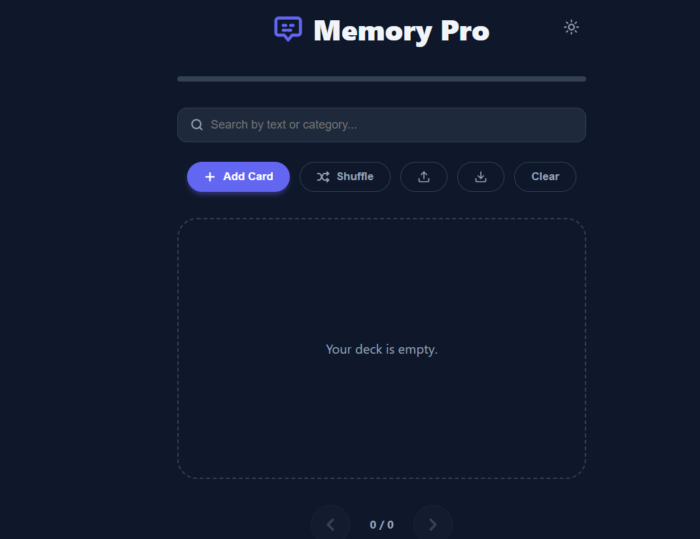
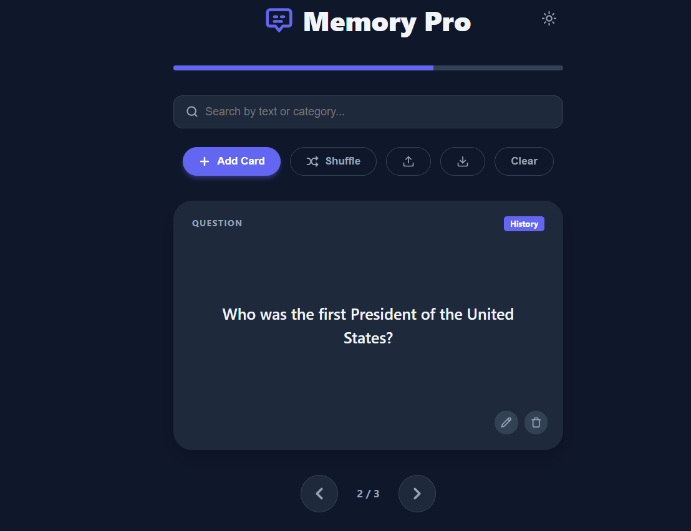
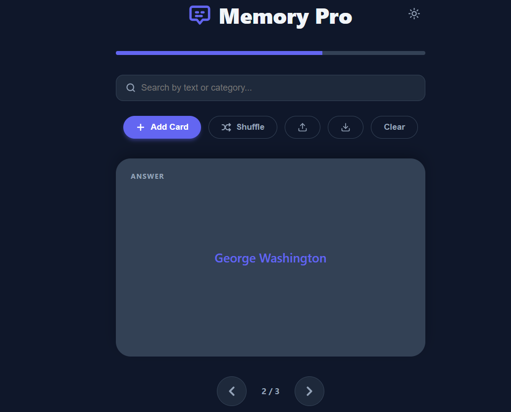

# 🧠 Memory Cards Pro

**Memory Cards Pro** is a lightweight, interactive flashcard web application designed for efficient learning and productivity. It empowers users to create, manage and master digital decks with features like categorization, real-time search and persistent storage.

---

## 🔗 Live Demo
**[View Live Demo Here](https://gemachistesfaye.github.io/Summer-Bootcamp-Projects//memory-cards/)** 

---

## 📸 Screenshot Table

| Add Card | Question View | Answer View |
|----------|---------------|-------------|
|  |  |  |

*Quick visual overview: Add a card, view the question and flip to see the answer.*

---

## 🚀 Features

* **Dynamic Deck Management** – Create, edit, and categorize cards on the fly.
* **Interactive UI** – Smooth flip animations via click or **Spacebar**.
* **Progress Tracking** – Visual progress bar to monitor your session position.
* **Smart Navigation** – Move through decks using buttons or **Arrow Keys**.
* **Search & Filter** – Find specific cards by text or category in real-time.
* **Randomized Learning** – Shuffle your deck to improve retention.
* **Data Portability** – Export your deck to JSON for backup or import existing ones.
* **Eye Comfort** – Built-in **Dark Mode** toggle for late-night study sessions.
* **Offline Persistence** – Powered by `localStorage`, your cards stay saved between browser sessions.

---

## 🛠️ Technologies Used

| Technology | Purpose |
| :--- | :--- |
| **HTML5** | Semantic structure and layout |
| **CSS3** | Modern styling, transitions, and CSS Variables |
| **JavaScript (ES6+)** | DOM manipulation, logic and local storage |
| **SVG** | Scalable, lightweight icons for a clean UI |

---

## 📂 Installation & Usage

### Local Setup
1. **Clone the repository:**
   ```bash
   git clone https://github.com/gemachistesfaye/Summer-Bootcamp-Projects.git
   ```
2. **Navigate to the folder:**
   ```bash
   cd Summer-Bootcamp-Projects/memory-cards
   ```
3. **Launch the app:** Open `index.html` in your browser.  
   *Pro Tip:* For full functionality (import/export JSON), use Live Server in VS Code.

---

### How It Works

* **Adding Cards:** Click Add Card, input your question, answer, and optional category, then save.
* **Flipping Cards:** Click a card or press Spacebar to reveal the answer.
* **Navigating:** Use Prev/Next buttons or keyboard Left/Right Arrows.
* **Shuffling:** Randomize your deck with the Shuffle button.
* **Backup & Restore:** Export your deck as JSON for backup or import existing decks.

---

### 📁 Project Structure

```text
memory-cards/
│
├── index.html      # Core structure & UI
├── style.css       # Theming and layout (Custom Variables)
├── script.js       # App logic and state management
└── README.md       # Project documentation
```

---

⚡️ **Future Roadmap**

* Spaced Repetition (SRS): Smarter review intervals for each card.
* Multimedia Support: Add images or audio clips to cards.
* Mobile Optimization: Refine touch experience for mobile users.
* Cloud Sync: Optional Firebase integration for cross-device syncing.

---

## 📬 Contact Information

* ✉️ **Email:** [gemachistesfaye36@gmail.com](mailto:gemachistesfaye36@gmail.com)  
* 📱 **Telegram:** [Gemachis | Data & Dev](https://t.me/GemachisTesfaye)
* 💼 **LinkedIn:** [Gemachis](https://www.linkedin.com/in/gemachis-tesfaye-137196318/)

Feel free to reach out!
