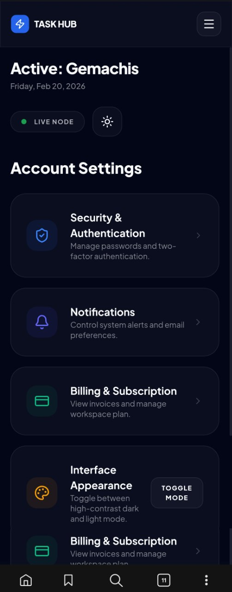
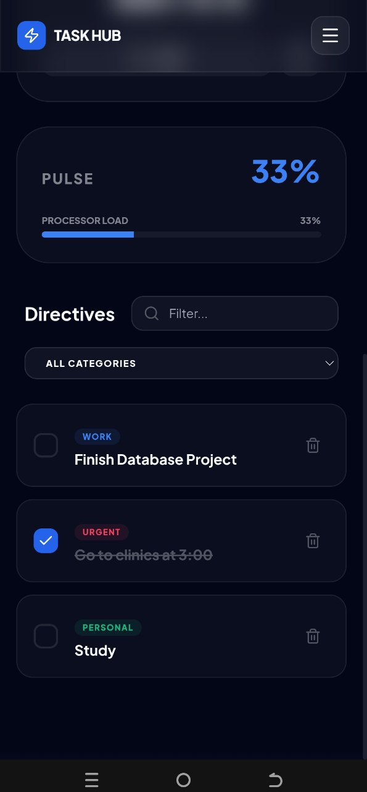
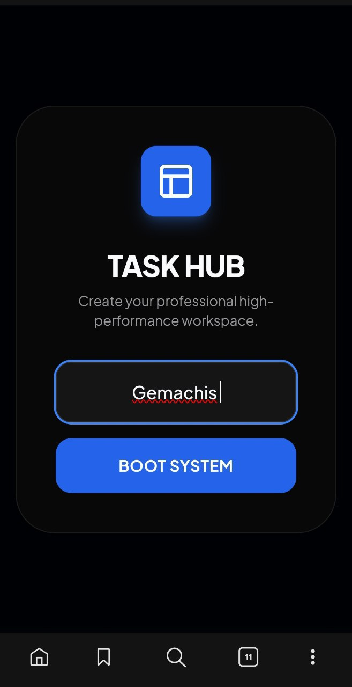

# 🧩 Task Hub – Personal Productivity Workspace

Task Hub is a modern, responsive productivity workspace built using **HTML, TailwindCSS and JavaScript**.  
It simulates a lightweight personal operating system that helps users manage tasks, track focus sessions and personalize their workspace — all powered by local storage.

> A frontend-focused project demonstrating UI design, state management, and responsive layout architecture.

---

## 🚀 Live Demo

👉 **[View Live Application](https://gemachistesfaye.github.io/Summer-Bootcamp-Projects/personal-task-manager/)**

---

## 📸 Screenshots

### 🖥 Desktop Views

| Dashboard | Deep Work Timer | Profile |
|------------|----------------|----------|
|  |  |  |

### 📱 Mobile Views

| Settings | Task Feed | Boot System |
|-----------|------------|-------------|
|  |  |  |

---

# 📌 Project Overview

### 🎯 Problem

Many simple task managers lack:
- Visual feedback
- Focus tracking tools
- Personalization features
- A modern and immersive interface

### 💡 Solution

Task Hub provides:
- Categorized task management
- Built-in Deep Work timer (Pomodoro-style)
- Dynamic dashboard analytics
- User profile customization
- A responsive and visually engaging UI

All implemented using **pure frontend technologies** without external backend services.

---

# ✨ Core Features

## 📋 Task Management
- Add new tasks (Directives)
- Categorize tasks (Personal, Work, Urgent)
- Real-time search and filtering
- Dynamic completion tracking
- Persistent storage using `localStorage`

## ⏱ Deep Work Timer
- Custom focus duration input
- Start / Pause / Reset controls
- Focus mode indicator
- Real-time countdown display

## 👤 User Profile System
- Onboarding boot screen
- Editable name, age, job title and bio
- Dynamic avatar generation
- Local profile persistence

## 📊 Dashboard Analytics
- Completion rate calculation
- Processor load simulation bar
- Responsive grid layout
- Clean data visualization elements

## 🎨 UI & Experience
- Glassmorphism interface
- Dark / Light theme toggle
- Mobile navigation drawer
- Smooth transitions & micro-interactions
- Fully responsive design (Desktop & Mobile)

---

# 🛠 Technical Implementation

## 🧠 State Management
- Application state handled with JavaScript
- Data stored and retrieved via `localStorage`
- Dynamic DOM rendering for tasks and user data

## 📱 Responsive Architecture
- TailwindCSS utility-based design
- Mobile-first layout adjustments
- Sidebar transforms into mobile navigation drawer

## 🎨 Theme Engine
- Theme toggling via dataset attributes
- Persistent theme preference stored locally

---

# 📂 Project Structure

```
task-hub/
│
├── screenshots/
│   ├── dashboard.png
│   ├── timer.png
│   ├── profile.png
│   ├── setting.jpg
│   ├── task.jpg
│   └── Boot-system.jpg
│
├── index.html
├── style.css
├── script.js
└── README.md
```

---

# ⚠️ Current Limitations

The **Account Settings** section is currently UI-only and does not include backend functionality.

The following features are placeholders:

- 🔐 Security & Authentication  
- 🔔 Notifications  
- 💳 Billing & Subscription  

No real authentication or database integration is implemented yet.  
All data is stored locally in the browser.

---

# 🚧 Future Improvements

- Backend authentication system
- Cloud database integration
- Real analytics dashboard
- Notification system
- Progressive Web App (PWA)
- Multi-user account support

---

# 🎓 What This Project Demonstrates

- Strong frontend UI development
- Responsive layout architecture
- JavaScript DOM manipulation
- Local storage data persistence
- Clean component-like structure
- User-centered design thinking

---

# 💡 Author

Built with focus and precision by **Gemachis**

🔗 GitHub: https://github.com/gemachistesfaye

---

> Task Hub is not just a to-do app — it’s a structured productivity workspace built to simulate a lightweight personal operating system.
