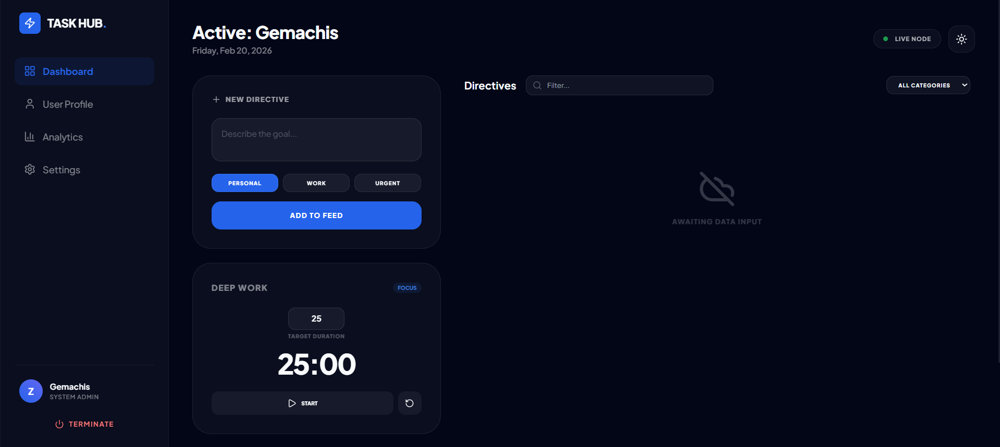
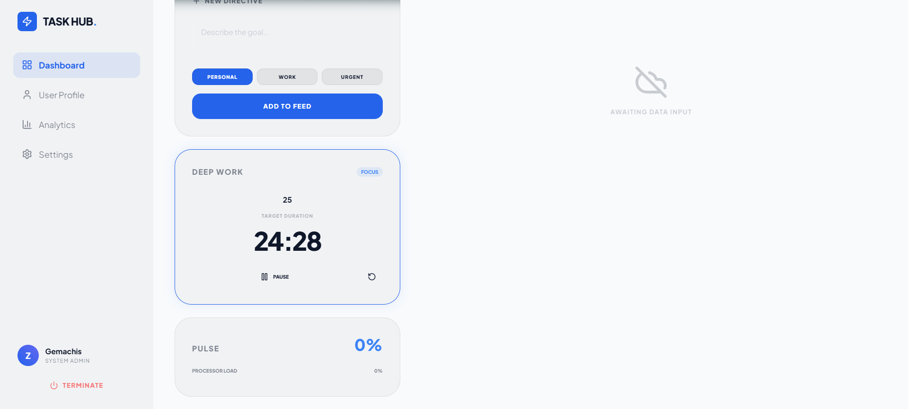
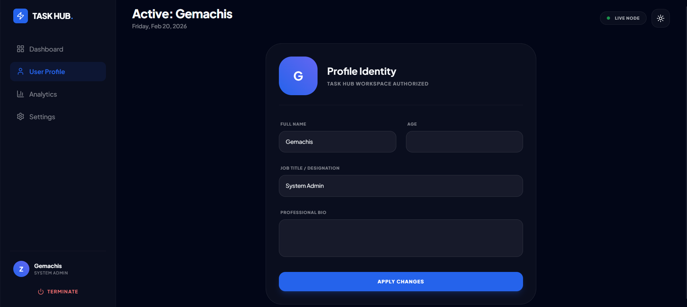
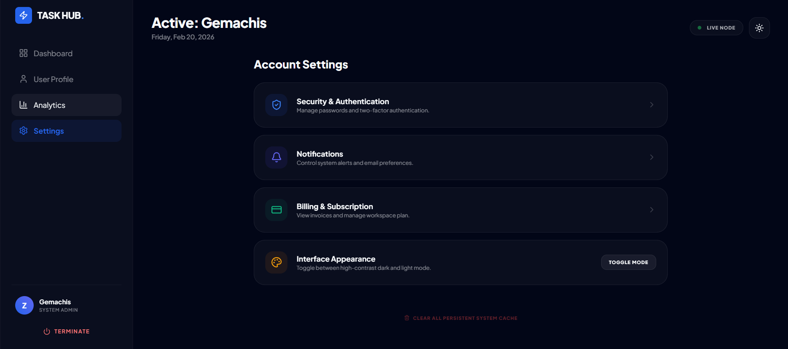

# 🧩 Task Hub – Personal Productivity Workspace

**Task Hub** is a modern productivity workspace built with **HTML, TailwindCSS and JavaScript**.  
It combines task management, a deep work timer, user profile customization and a responsive dashboard experience — all powered by local storage.

Task Hub is designed to help users stay focused, organized and productive in a clean and immersive interface.

---

## 🚀 Live Demo

👉 Add your live demo link here  
`https://your-live-link.com`

---

## 📸 Screenshots

| Dashboard | Deep Work Timer | Profile |
|-----------|-----------------|----------|
|  |  |  |

| Settings | Mobile View | Onboarding |
|----------|--------------|-------------|
|  |  |  |

> 💡 Make sure your images are inside a folder named `screenshots` in your project root.

---

## ✨ Features

### 📋 Task Management
- Add new tasks (Directives)
- Categorize tasks (Personal, Work, Urgent)
- Search and filter tasks in real-time
- Dynamic completion tracking
- Persistent storage using `localStorage`

### ⏱ Deep Work Timer
- Custom focus duration input
- Start / Pause / Reset functionality
- Focus mode indicator
- Real-time countdown display

### 👤 User Profile
- Onboarding system
- Editable name, age, job title, and bio
- Dynamic avatar display
- Profile data stored locally

### 📊 Dashboard Overview
- Completion rate indicator
- Processor load visual bar
- Task feed system
- Responsive grid layout

### 🎨 Interface & Experience
- Glassmorphism UI design
- Dark / Light theme toggle
- Fully responsive (Desktop + Mobile)
- Mobile navigation drawer
- Smooth transitions and animations

### 🔐 Session Control
- Confirm modal before logout
- Clear all persistent workspace data
- Local session reset system

---

## 🛠 Tech Stack

| Technology | Purpose |
|------------|----------|
| **HTML5** | Structure |
| **TailwindCSS (CDN)** | Styling & layout |
| **JavaScript (ES6)** | Logic & interactivity |
| **Lucide Icons** | Icon system |
| **Google Fonts** | Typography |
| **localStorage API** | Data persistence |

---

## 📂 Project Structure

```
task-hub/
│
├── screenshots/
│   ├── dashboard.png
│   ├── timer.png
│   ├── profile.png
│   ├── settings.png
│   ├── mobile.png
│   └── onboarding.png
│
├── index.html
├── style.css
├── script.js
└── README.md
```

---

## ⚠️ Current Limitations

The **Account Settings** section is currently UI-only and does not include backend functionality.

The following features are placeholders:

- 🔐 Security & Authentication
- 🔔 Notifications
- 💳 Billing & Subscription

These are planned for future expansion.

---

## 💡 Author

Built with focus and precision by **Gemachis**

GitHub: https://github.com/gemachistesfaye
